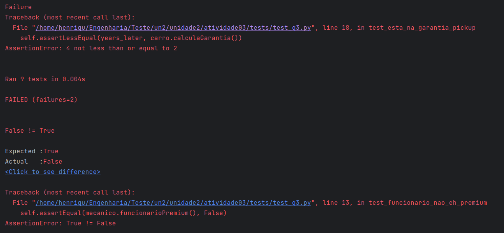
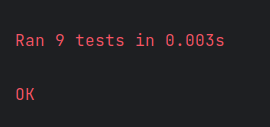

# Atividade 03

## Respostas das questões 1 e 2

**Aluno**: Luís Henrique Lima Santos
**Disciplina**: Teste de Software

### Questão 1
Não houve comportamentos indejados, os testes continuaram passando. Entretanto para o comportamento se manter, foi-se
necessário criar novos métodos para atender as novas expectativas

### Questão 2
Sim. Testes que verificavam se uma biblioteca era ou não patrimônio histórico falharam quando passou a ser 1950 e não
mais 1980

### Questão 3

Ao realizar as mudanças, os seguintes testes quebraram:

Após realizar o teste de regressão, não houve mais erros no código:

